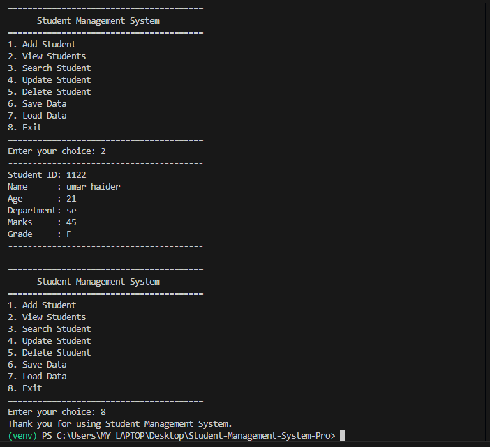

# 🎓 Student Management System Pro

A **console-based Student Management System** built with **Python** that demonstrates **Object-Oriented Programming (OOP)**, **CRUD operations**, **JSON file handling**, and **modular programming**.

This project was built as part of my Python learning journey and serves as a portfolio project before moving into Data Science and Machine Learning.

---

## 📸 Screenshot

> Save your uploaded screenshot as **`screenshot.png`** in the project root, then GitHub will display it automatically.



---

# ✨ Features

- ➕ Add Student
- 👀 View Students
- 🔍 Search Student
- ✏️ Update Student
- ❌ Delete Student
- 💾 Save Student Data to JSON
- 📂 Load Student Data from JSON
- 🎓 Automatic Grade Calculation
- 📦 Modular Project Structure
- 🛡️ Exception Handling

---

# 🛠️ Technologies Used

- Python 3
- Object-Oriented Programming (OOP)
- JSON
- File Handling
- Git
- GitHub
- Visual Studio Code

---

# 📂 Project Structure

```text
Student-Management-System-Pro/
│
├── data/
├── logs/
├── venv/
│
├── main.py
├── student.py
├── manager.py
├── utils.py
├── decorators.py
│
├── students.json
├── requirements.txt
├── .gitignore
├── README.md
└── screenshot.png
```

---

# 📚 Concepts Covered

This project demonstrates the following Python concepts:

- Classes & Objects
- Constructors (`__init__`)
- Methods
- Encapsulation
- Lists
- Loops
- Conditional Statements
- Functions
- Type Hints
- JSON Serialization
- File Handling
- Modular Programming
- CRUD Operations
- Error Handling

---

# ⚙️ How It Works

The application provides an interactive menu where users can:

1. Add Student
2. View Students
3. Search Student
4. Update Student
5. Delete Student
6. Save Data
7. Load Data
8. Exit

Student records are stored in a JSON file, allowing data to persist between program executions.

---

# 🚀 Getting Started

## Clone the Repository

```bash
git clone https://github.com/muhammadusmanshakir/Student-Management-System-Pro.git
```

## Navigate to the Project

```bash
cd Student-Management-System-Pro
```

## (Optional) Create Virtual Environment

```bash
python -m venv venv
```

### Windows

```bash
venv\Scripts\activate
```

### Linux/macOS

```bash
source venv/bin/activate
```

## Install Dependencies

```bash
pip install -r requirements.txt
```

## Run the Project

```bash
python main.py
```

---

# 📷 Sample Output

```text
========================================
      Student Management System
========================================

1. Add Student
2. View Students
3. Search Student
4. Update Student
5. Delete Student
6. Save Data
7. Load Data
8. Exit

========================================
```

---

# 📌 Future Improvements

- Login Authentication
- SQLite Database Integration
- GUI Version using Tkinter
- Web Version using Flask
- Search by Name
- Student Attendance
- GPA Calculator
- Export Data to CSV
- Logging System
- Unit Testing

---

# 🧠 What I Learned

While building this project, I practiced:

- Designing classes
- Managing objects
- Writing modular code
- Working with JSON files
- Implementing CRUD operations
- Using Git & GitHub effectively
- Organizing a real-world Python project

---

# 👨‍💻 Author

**Muhammad Usman Shakir**

- 🎓 BS Software Engineering — PUCIT
- 🤖 Aspiring AI & Machine Learning Engineer
- 📚 Currently learning Python, Data Science, and Machine Learning

GitHub:
https://github.com/muhammadusmanshakir

---

# ⭐ Support

If you found this project helpful, consider giving it a **⭐ Star** on GitHub.

It motivates me to keep building and sharing more projects.

---

> **"Small progress every day leads to big achievements." 🚀**